# CAM-Pulse Architecture Diagrams

Three Mermaid diagrams covering module dependencies, data flow, and CLI command hierarchy.

---

## Diagram 1: Module Dependency Map

Shows the top 20 most important modules and their import relationships.
Arrows point from the importing module to the dependency.

```mermaid
graph TD
    subgraph Core["core/"]
        config["core.config<br/><i>Pydantic settings</i>"]
        models["core.models<br/><i>Pydantic data models</i>"]
        factory["core.factory<br/><i>ClawContext DI</i>"]
        exceptions["core.exceptions"]
    end

    subgraph DB["db/"]
        engine["db.engine<br/><i>SQLite + WAL</i>"]
        repository["db.repository<br/><i>Data access layer</i>"]
        embeddings["db.embeddings<br/><i>Vector encode/store</i>"]
    end

    subgraph Memory["memory/"]
        semantic["memory.semantic<br/><i>Methodology CRUD</i>"]
        hybrid_search["memory.hybrid_search<br/><i>Vector + FTS5</i>"]
        fitness["memory.fitness<br/><i>6-dim scoring</i>"]
        lifecycle["memory.lifecycle<br/><i>State machine</i>"]
        cag_retriever["memory.cag_retriever<br/><i>KV cache retrieval</i>"]
        rag_adapter["memory.rag_adapter<br/><i>RAG-to-CAG convert</i>"]
    end

    subgraph LLM["llm/"]
        llm_client["llm.client<br/><i>OpenRouter async</i>"]
        token_tracker["llm.token_tracker"]
    end

    subgraph Agents["agents/"]
        interface["agents.interface<br/><i>ABC + OpenRouter</i>"]
        claude_agent["agents.claude"]
        codex_agent["agents.codex"]
        gemini_agent["agents.gemini"]
        grok_agent["agents.grok"]
    end

    subgraph Evolution["evolution/"]
        kelly["evolution.kelly<br/><i>Bayesian Kelly</i>"]
        assimilation["evolution.assimilation<br/><i>Capability engine</i>"]
        pattern_learner["evolution.pattern_learner"]
        prompt_evolver["evolution.prompt_evolver"]
        routing_optimizer["evolution.routing_optimizer"]
    end

    subgraph Orchestration["Orchestration Layer"]
        cycle["cycle.py<br/><i>Macro/Meso/Micro/NanoClaw</i>"]
        dispatcher["dispatcher.py<br/><i>Bayesian routing</i>"]
        evaluator["evaluator.py<br/><i>17-prompt battery</i>"]
        planner["planner.py<br/><i>Gap analysis + tasks</i>"]
        verifier["verifier.py<br/><i>7-check audit gate</i>"]
        fleet["fleet.py<br/><i>Multi-repo orchestrator</i>"]
        miner["miner.py<br/><i>Repo knowledge extraction</i>"]
    end

    subgraph Pulse["pulse/"]
        pulse_orch["pulse.orchestrator<br/><i>Scan/filter/assimilate</i>"]
        scout["pulse.scout<br/><i>X-powered search</i>"]
        novelty["pulse.novelty<br/><i>Novelty filter</i>"]
        freshness["pulse.freshness<br/><i>Staleness monitor</i>"]
    end

    subgraph Support["Support"]
        cli["cli.py<br/><i>Typer CLI ~10K lines</i>"]
        self_consumer["self_consumer.py<br/><i>Meta-pattern mining</i>"]
        budget["budget.py"]
        security_mod["security.policy<br/><i>Autonomy levels</i>"]
    end

    %% Factory wires everything
    factory --> config
    factory --> engine
    factory --> repository
    factory --> embeddings
    factory --> llm_client
    factory --> token_tracker
    factory --> security_mod
    factory --> interface

    %% DB layer
    engine --> config
    repository --> engine
    repository --> models
    embeddings --> config

    %% Memory layer
    semantic --> repository
    semantic --> embeddings
    semantic --> hybrid_search
    hybrid_search --> repository
    hybrid_search --> embeddings
    hybrid_search --> fitness
    fitness --> models
    lifecycle --> repository
    lifecycle --> fitness

    %% Orchestration
    cycle --> factory
    cycle --> models
    cycle --> llm_client
    dispatcher --> models
    dispatcher --> exceptions
    evaluator --> dispatcher
    evaluator --> repository
    planner --> models
    planner --> dispatcher
    verifier --> embeddings
    verifier --> models
    fleet --> repository
    fleet --> config

    %% Mining
    miner --> repository
    miner --> llm_client
    miner --> semantic
    miner --> config

    %% Evolution
    kelly --> repository
    assimilation --> repository
    assimilation --> llm_client
    pattern_learner --> repository

    %% Agents
    claude_agent --> interface
    codex_agent --> interface
    gemini_agent --> interface
    grok_agent --> interface
    interface --> models

    %% Pulse
    pulse_orch --> engine
    pulse_orch --> scout
    pulse_orch --> novelty

    %% Self-consumer
    self_consumer --> repository
    self_consumer --> llm_client
    self_consumer --> semantic

    %% CLI drives everything
    cli --> factory
    cli --> cycle
    cli --> miner
    cli --> fleet
    cli --> evaluator
    cli --> dispatcher
    cli --> pulse_orch
    cli --> semantic

    %% Styling
    classDef core fill:#4a90d9,stroke:#2c5f8a,color:#fff
    classDef db fill:#50b848,stroke:#2d7a26,color:#fff
    classDef mem fill:#e6a23c,stroke:#b37d1e,color:#fff
    classDef llm fill:#9b59b6,stroke:#6c3483,color:#fff
    classDef agent fill:#e74c3c,stroke:#a93226,color:#fff
    classDef evo fill:#1abc9c,stroke:#148f77,color:#fff
    classDef orch fill:#f39c12,stroke:#d68910,color:#000
    classDef pulse fill:#3498db,stroke:#2471a3,color:#fff
    classDef support fill:#95a5a6,stroke:#717d7e,color:#fff

    class config,models,factory,exceptions core
    class engine,repository,embeddings db
    class semantic,hybrid_search,fitness,lifecycle,cag_retriever,rag_adapter mem
    class llm_client,token_tracker llm
    class interface,claude_agent,codex_agent,gemini_agent,grok_agent agent
    class kelly,assimilation,pattern_learner,prompt_evolver,routing_optimizer evo
    class cycle,dispatcher,evaluator,planner,verifier,fleet,miner orch
    class pulse_orch,scout,novelty,freshness pulse
    class cli,self_consumer,budget,security_mod support
```

---

## Diagram 2: Data Flow

End-to-end data flow from repo mining through knowledge injection, agent execution,
and the feedback/fitness/lifecycle loop.

```mermaid
flowchart LR
    subgraph Input["1. Knowledge Acquisition"]
        mine["cam mine<br/>Repo Mining"]
        pulse_scan["cam pulse scan<br/>X-Scout Discovery"]
        hf_ingest["cam pulse ingest-hf<br/>HuggingFace Mount"]
        community_import["cam kb community import<br/>Community Hub"]
    end

    subgraph Store["2. Storage Layer"]
        sqlite[("SQLite + WAL<br/>claw.db")]
        fts5[("FTS5 Index<br/>Full-Text Search")]
        vec[("sqlite-vec<br/>Vector Index")]
    end

    subgraph Embed["3. Embedding"]
        embed_engine["EmbeddingEngine<br/>gemini-embedding-2-preview<br/>384 dimensions"]
    end

    subgraph Search["4. Retrieval"]
        hybrid["HybridSearch<br/>Vector + FTS5 merge"]
        cag["CAG Retriever<br/>KV-cache corpus"]
    end

    subgraph Inject["5. Knowledge Injection"]
        prompt_build["_build_openrouter_prompt()<br/>interface.py:525-590"]
    end

    subgraph Agent["6. Agent Execution"]
        dispatch["Dispatcher<br/>Kelly + Bayesian routing"]
        agents["Agents<br/>Claude / Codex / Gemini / Grok"]
        correct["Correction Loop<br/>act -> verify -> correct<br/>max 3 attempts"]
    end

    subgraph Verify["7. Verification"]
        verifier_gate["Verifier — 7-Check Gate<br/>1. Dependency Jail<br/>2. Style Match<br/>3. Chaos Check<br/>4. Placeholder Scan<br/>5. Drift Alignment<br/>6. Claim Validation<br/>7. LLM Deep Review<br/>+ Metric Expectations"]
    end

    subgraph Feedback["8. Feedback Loop"]
        outcome["TaskOutcome<br/>success / failure"]
        fitness_calc["Fitness Calculator<br/>6-dim EMA scoring"]
        lifecycle_sm["Lifecycle State Machine<br/>embryonic -> viable -> thriving<br/>-> declining -> dormant -> dead"]
        kelly_update["Kelly Sizer<br/>Update posteriors"]
    end

    subgraph Evolve["9. Evolution"]
        assimilate["Assimilation Engine<br/>Extract capabilities<br/>Discover synergies<br/>Compose composites"]
        self_consume["Self-Consumer<br/>Meta-pattern mining"]
        pattern_learn["Pattern Learner<br/>Global promotion"]
    end

    %% Flow: Acquisition to Storage
    mine -->|"LLM extracts<br/>methodologies"| sqlite
    pulse_scan -->|"Clone + mine<br/>novel repos"| sqlite
    hf_ingest -->|"Mount HF datasets<br/>as methodologies"| sqlite
    community_import -->|"Quarantine + approve"| sqlite

    %% Storage to Embedding
    sqlite -->|"Raw methodology<br/>text"| embed_engine
    embed_engine -->|"384-dim vector"| vec
    sqlite -->|"Tokenized text"| fts5

    %% Retrieval
    vec -->|"Cosine similarity<br/>top-K"| hybrid
    fts5 -->|"BM25 ranked"| hybrid
    sqlite -->|"Full corpus<br/>serialized"| cag

    %% Injection
    hybrid -->|"Ranked methodology<br/>context"| prompt_build
    cag -->|"KV-cache<br/>corpus block"| prompt_build

    %% Agent Execution
    prompt_build -->|"Enriched prompt<br/>with knowledge"| dispatch
    dispatch -->|"Route by<br/>task_type"| agents
    agents -->|"TaskOutcome<br/>with diff"| correct
    correct -->|"Re-prompt<br/>on failure"| agents
    correct -->|"Final outcome"| verifier_gate

    %% Verification
    verifier_gate -->|"PASS"| outcome
    verifier_gate -->|"FAIL + violations"| correct

    %% Feedback
    outcome -->|"success/fail<br/>+ quality score"| fitness_calc
    fitness_calc -->|"Updated<br/>fitness_score"| lifecycle_sm
    fitness_calc -->|"Win/loss<br/>per agent"| kelly_update
    kelly_update -->|"Updated<br/>routing weights"| dispatch
    lifecycle_sm -->|"State transition"| sqlite

    %% Evolution
    outcome -->|"New methodology"| assimilate
    assimilate -->|"Capability edges<br/>+ composites"| sqlite
    outcome -->|"Completed tasks"| self_consume
    self_consume -->|"Meta-patterns"| sqlite
    sqlite -->|"Promoted globals"| pattern_learn
    pattern_learn -->|"Attribution<br/>evidence"| sqlite

    %% Styling
    style Input fill:#e8f5e9,stroke:#4caf50
    style Store fill:#e3f2fd,stroke:#2196f3
    style Embed fill:#f3e5f5,stroke:#9c27b0
    style Search fill:#fff3e0,stroke:#ff9800
    style Inject fill:#fce4ec,stroke:#e91e63
    style Agent fill:#fff8e1,stroke:#ffc107
    style Verify fill:#ffebee,stroke:#f44336
    style Feedback fill:#e0f2f1,stroke:#009688
    style Evolve fill:#f1f8e9,stroke:#8bc34a
```

---

## Diagram 3: CLI Command Tree

Complete `cam` command hierarchy showing all subcommands and their nesting.

```mermaid
graph TD
    cam["cam"]

    %% Top-level commands
    cam --> evaluate["evaluate<br/><i>Inspect + score repo</i>"]
    cam --> enhance["enhance<br/><i>Improve repo in loop</i>"]
    cam --> fleet_enhance["fleet-enhance<br/><i>Multi-repo enhancement</i>"]
    cam --> mine_cmd["mine<br/><i>Learn from repos</i>"]
    cam --> mine_workspace["mine-workspace<br/><i>Mine directory tree</i>"]
    cam --> mine_self["mine-self<br/><i>Mine own codebase</i>"]
    cam --> ideate["ideate<br/><i>Invent app concepts</i>"]
    cam --> preflight["preflight<br/><i>Clarify task intent</i>"]
    cam --> create["create<br/><i>Create/augment repo</i>"]
    cam --> validate_cmd["validate<br/><i>Verify against spec</i>"]

    %% learn subgroup
    cam --> learn["learn"]
    learn --> learn_report["report<br/><i>Continuum report</i>"]
    learn --> learn_delta["delta<br/><i>Knowledge delta</i>"]
    learn --> learn_reassess["reassess<br/><i>Reassessment cycle</i>"]
    learn --> learn_synergies["synergies<br/><i>Cross-domain links</i>"]
    learn --> learn_usage["usage<br/><i>Methodology usage stats</i>"]
    learn --> learn_search["search<br/><i>Search learned knowledge</i>"]

    %% task subgroup
    cam --> task["task"]
    task --> task_add["add<br/><i>Add a goal/task</i>"]
    task --> task_quickstart["quickstart<br/><i>Quick task setup</i>"]
    task --> task_runbook["runbook<br/><i>Generate runbook</i>"]
    task --> task_results["results<br/><i>View task results</i>"]

    %% forge subgroup
    cam --> forge["forge"]
    forge --> forge_export["export<br/><i>Export knowledge packs</i>"]
    forge --> forge_benchmark["benchmark<br/><i>Benchmark knowledge</i>"]

    %% doctor subgroup
    cam --> doctor["doctor"]
    doctor --> doctor_keycheck["keycheck<br/><i>API key validation</i>"]
    doctor --> doctor_status["status<br/><i>System health</i>"]
    doctor --> doctor_expectations["expectations<br/><i>Metric expectations</i>"]
    doctor --> doctor_audit["audit<br/><i>Audit trail</i>"]
    doctor --> doctor_routing["routing<br/><i>Agent routing table</i>"]

    %% kb subgroup
    cam --> kb["kb"]
    kb --> kb_seed["seed<br/><i>Load seed knowledge</i>"]
    kb --> kb_stats["stats<br/><i>Knowledge statistics</i>"]
    kb --> kb_search["search<br/><i>Hybrid NL search</i>"]
    kb --> kb_capability["capability<br/><i>Deep-dive on one cap</i>"]
    kb --> kb_patterns["patterns<br/><i>Global promoted meths</i>"]
    kb --> kb_domains["domains<br/><i>Domain landscape</i>"]
    kb --> kb_synergies["synergies<br/><i>Cross-domain synergies</i>"]

    %% kb community sub-subgroup
    kb --> community["community"]
    community --> comm_publish["publish<br/><i>Export to HF hub</i>"]
    community --> comm_browse["browse<br/><i>Preview hub knowledge</i>"]
    community --> comm_import["import<br/><i>Import from hub/file</i>"]
    community --> comm_approve["approve<br/><i>Review quarantine</i>"]
    community --> comm_status["status<br/><i>Community stats</i>"]

    %% kb instances sub-subgroup
    kb --> instances["instances"]
    instances --> inst_list["list<br/><i>List ganglia</i>"]
    instances --> inst_manifest["manifest<br/><i>Generate brain manifest</i>"]
    instances --> inst_query["query<br/><i>Cross-ganglion search</i>"]
    instances --> inst_add["add<br/><i>Register ganglion</i>"]
    instances --> inst_remove["remove<br/><i>Unregister ganglion</i>"]

    %% pulse subgroup
    cam --> pulse["pulse"]
    pulse --> pulse_scan["scan<br/><i>X-Scout discovery</i>"]
    pulse --> pulse_daemon["daemon<br/><i>Perpetual polling</i>"]
    pulse --> pulse_status["status<br/><i>Pulse health</i>"]
    pulse --> pulse_discoveries["discoveries<br/><i>View found repos</i>"]
    pulse --> pulse_scans["scans<br/><i>Scan history</i>"]
    pulse --> pulse_report["report<br/><i>Assimilation report</i>"]
    pulse --> pulse_preflight["preflight<br/><i>Pre-scan checks</i>"]
    pulse --> pulse_ingest["ingest<br/><i>Clone + mine repo</i>"]
    pulse --> pulse_ingest_hf["ingest-hf<br/><i>Mount HuggingFace dataset</i>"]
    pulse --> pulse_freshness["freshness<br/><i>Staleness monitor</i>"]
    pulse --> pulse_refresh["refresh<br/><i>Refresh stale repos</i>"]

    %% self-enhance subgroup
    cam --> self_enhance["self-enhance"]
    self_enhance --> se_status["status<br/><i>Enhancement state</i>"]
    self_enhance --> se_start["start<br/><i>Begin self-enhancement</i>"]
    self_enhance --> se_validate["validate<br/><i>Verify enhanced clone</i>"]
    self_enhance --> se_swap["swap<br/><i>Replace with enhanced</i>"]
    self_enhance --> se_rollback["rollback<br/><i>Revert to original</i>"]

    %% ab-test subgroup
    cam --> ab_test["ab-test"]
    ab_test --> ab_start["start<br/><i>Begin ablation test</i>"]
    ab_test --> ab_status["status<br/><i>View test results</i>"]
    ab_test --> ab_stop["stop<br/><i>End test + cleanup</i>"]

    %% security subgroup
    cam --> security["security"]
    security --> sec_scan["scan<br/><i>TruffleHog secret scan</i>"]
    security --> sec_status["status<br/><i>Security posture</i>"]

    %% cag subgroup
    cam --> cag["cag"]
    cag --> cag_rebuild["rebuild<br/><i>Rebuild KV cache</i>"]
    cag --> cag_status["status<br/><i>Cache status</i>"]
    cag --> cag_convert["convert<br/><i>RAG-to-CAG conversion</i>"]

    %% Styling
    classDef root fill:#2c3e50,stroke:#1a252f,color:#ecf0f1,font-weight:bold
    classDef group fill:#34495e,stroke:#2c3e50,color:#ecf0f1,font-weight:bold
    classDef subgroup fill:#7f8c8d,stroke:#5d6d7e,color:#fff
    classDef cmd fill:#ecf0f1,stroke:#bdc3c7,color:#2c3e50
    classDef toplevel fill:#d5f5e3,stroke:#27ae60,color:#1a5028

    class cam root
    class learn,task,forge,doctor,kb,pulse,self_enhance,ab_test,security,cag group
    class community,instances subgroup
    class evaluate,enhance,fleet_enhance,mine_cmd,mine_workspace,mine_self,ideate,preflight,create,validate_cmd toplevel
    class learn_report,learn_delta,learn_reassess,learn_synergies,learn_usage,learn_search cmd
    class task_add,task_quickstart,task_runbook,task_results cmd
    class forge_export,forge_benchmark cmd
    class doctor_keycheck,doctor_status,doctor_expectations,doctor_audit,doctor_routing cmd
    class kb_seed,kb_stats,kb_search,kb_capability,kb_patterns,kb_domains,kb_synergies cmd
    class comm_publish,comm_browse,comm_import,comm_approve,comm_status cmd
    class inst_list,inst_manifest,inst_query,inst_add,inst_remove cmd
    class pulse_scan,pulse_daemon,pulse_status,pulse_discoveries,pulse_scans,pulse_report,pulse_preflight,pulse_ingest,pulse_ingest_hf,pulse_freshness,pulse_refresh cmd
    class se_status,se_start,se_validate,se_swap,se_rollback cmd
    class ab_start,ab_status,ab_stop cmd
    class sec_scan,sec_status cmd
    class cag_rebuild,cag_status,cag_convert cmd
```

---

## Legend

| Color / Group | Meaning |
|---|---|
| **Blue (core/)** | Configuration, data models, dependency injection, exceptions |
| **Green (db/)** | SQLite engine, Repository data access, embedding storage |
| **Orange (memory/)** | Semantic memory, hybrid search, fitness scoring, lifecycle, CAG |
| **Purple (llm/)** | OpenRouter async client, token tracking |
| **Red (agents/)** | Agent ABC and four concrete agents (Claude, Codex, Gemini, Grok) |
| **Teal (evolution/)** | Kelly criterion, assimilation, pattern learning, prompt evolution |
| **Yellow (orchestration)** | Claw Cycle, Dispatcher, Evaluator, Planner, Verifier, Fleet, Miner |
| **Light blue (pulse/)** | X-Scout, novelty filter, freshness monitor, PULSE orchestrator |
| **Gray (support)** | CLI, self-consumer, budget, security policy |

## Key Architectural Patterns

**Dependency Injection**: `ClawFactory.create()` in `core/factory.py` builds the full dependency graph and returns a `ClawContext` dataclass with all wired components.

**Four-Scale Claw Cycle** (`cycle.py`):
- **MacroClaw (Fleet)** -- scans repo fleet, ranks by enhancement potential
- **MesoClaw (Project)** -- runs 17-prompt evaluation battery, produces plan
- **MicroClaw (Module)** -- routes one task to agent, monitors, verifies; includes inner correction loop (act -> verify -> correct, max 3 attempts)
- **NanoClaw (Self-improvement)** -- updates scores and routing after each task

**Bayesian Kelly Routing** (`evolution/kelly.py`): Replaces static exploration rate with posterior-driven agent allocation using Sukhov (2026) equation 13.

**Dual Retrieval** (`memory/hybrid_search.py` + `memory/cag_retriever.py`):
- **RAG path**: sqlite-vec cosine similarity + FTS5 BM25, merged with fitness weighting (40%)
- **CAG path**: Full corpus serialized into KV-cache prompt block (vectorless)

**Memory Ecosystem** (`memory/fitness.py` + `memory/lifecycle.py`): 6-dimensional fitness scoring with EMA blending drives a competitive exclusion lifecycle (embryonic -> viable -> thriving -> declining -> dormant -> dead).
